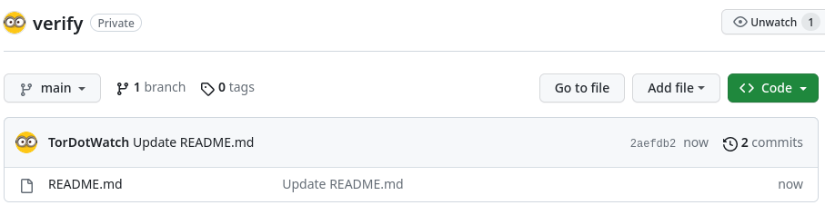

# 🔒 Verify TorDotWatch index.html  
Current SHA256 Hash: <strong>ebccc54162f0092cc5ca1c76e084d6f893be19963edeafa6800fd51885fea696</strong>  
<strong>Verify the current Hash 'Body SHA-256' 👉 </strong> **[Virustotal](https://www.virustotal.com/gui/url/7aa47c5b5f314703beb3c29d04b745a26935551fc812932492a76b25750fdddb/details)**
 
 
<strong>Follow and check changes! Click on 'commits'</strong>  

