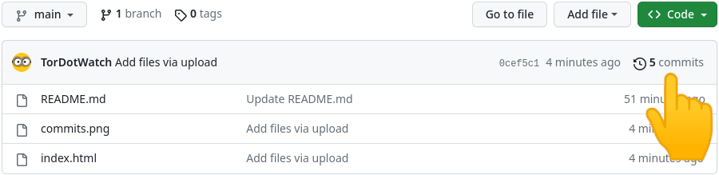

# 🔒 Verify Tor.Watch index.html <br>
Current Body SHA-256 Hash: <strong>672cbd9c2efd1809416c9091c0002a96b4dc27632d2fcaafc5b6bcd764c32953</strong> <br>
<strong>Verify the current Hash 'Body SHA-256' 👉 </strong> **[Virustotal](https://www.virustotal.com/gui/url/07d46003ab6804129ea73c3106102f6ec9b5bccf86aa35223c913e11eaacad20/details)**
<br>
<br>
<strong>Follow and check changes! Click on 'commits'</strong> <br>
<br>

<br>
<br>
<strong>Check the hash of the home page (index.html) uploaded to github! 👉 </strong> **[Virustotal](https://www.virustotal.com/gui/url/e81f186f7f9ddaded2a83fc1466977338c2ab55316e196b783195fd3e1f6ccc2/details)**
<br>
<strong>⚠️Both hashes must match⚠️</strong><br>
<br />
```bash
-----BEGIN PGP SIGNED MESSAGE-----
Hash: SHA512

672cbd9c2efd1809416c9091c0002a96b4dc27632d2fcaafc5b6bcd764c32953

19 DEC 2023


-----BEGIN PGP SIGNATURE-----

iQKTBAEBCgB9FiEEB1GiDTFIxgyrRqkzvnuv240rTgoFAmWCDRlfFIAAAAAALgAo
aXNzdWVyLWZwckBub3RhdGlvbnMub3BlbnBncC5maWZ0aGhvcnNlbWFuLm5ldDA3
NTFBMjBEMzE0OEM2MENBQjQ2QTkzM0JFN0JBRkRCOEQyQjRFMEEACgkQvnuv240r
TgqH1A//QF61XH3U/3nrTcRU88yzIo2Bs1KMfgYYnf+2wsudZ2BMp8RB0NRFf1zi
T5lMewSkbKzgEGFE99kcmyQ+nuogGnnlWrPxCgG053f9dznl+lAIOrT0owYXk3Ji
JAVbusFuOBguAwpgH9M8LBXqfQsGxonkM8fWB8AkTfQbphbkGWe0MVj2VSaXCEPr
UumKH/A21omLd/4Ty0TCVkK3Dp1AB2xUW5CQ+FL/pl7b2g2AdGBl6G3F+woysQEM
J0zuTW26vTW1l+2g6TptuEIji9E/8DDOYjRIGei8jXCGCJTPzLtbI/Sd5iyDavid
OhTMk6PBohUt3t/POqcP38FEAPnYJcSdNQCKwQmaaWjG7QvLrkRDodvYCJ/T4Ecy
YjY/RMQs3QCMVROi5VpRxtMsrqxrt0Dn49p6CzxnorFSr9uiCzMYUZxu9jE2Lz/9
keNg3v4IZDnPCO8frbddm9XGYHGbA9PUwvn7qzLx6vKytPXjTSLxWpMTtS9sRexz
plgm4PpEHdcTtp7LPIv3jyYXdEqzCnZdKf1ig2Ul30Su5IV/oiBxO5+E8TQD5yb1
0/7AEScVpbHNMHYdrnLWnV5htZfACRWLlBJnjUHfJPZtzasBiTaUdJbpBMU2xP6w
HG1jwBp77lvqK5F4HLD29Bno1YyDCpyf3+jlIgbD2gQxswmMoDM=
=0gvF
-----END PGP SIGNATURE-----

```
